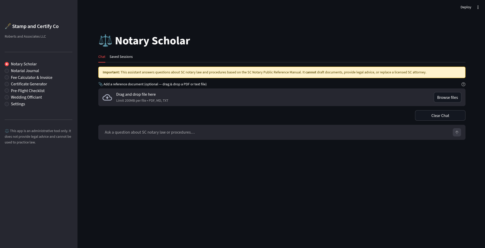
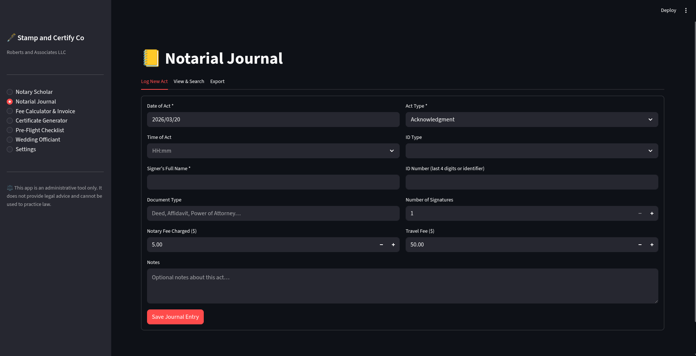
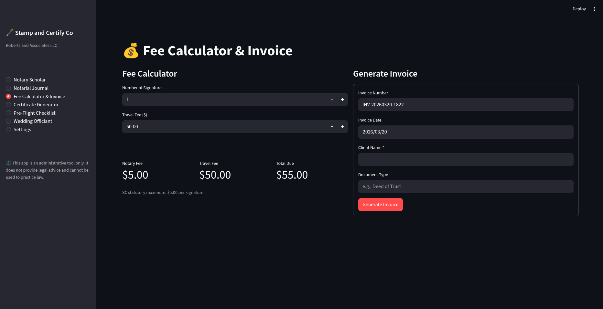
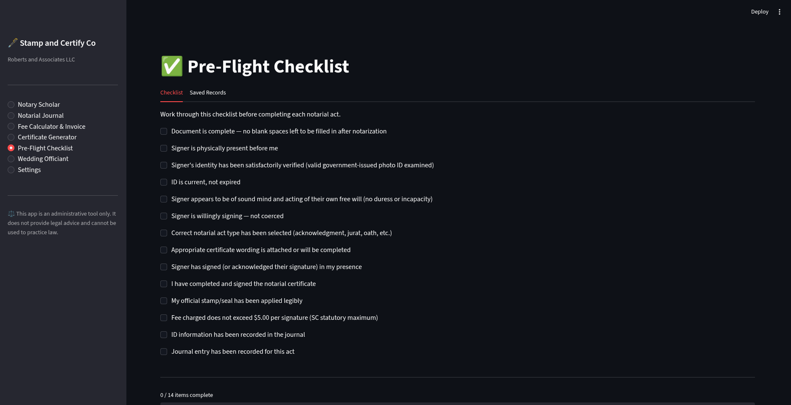

# Notary Assistant — Stamp and Certify Co

A local Streamlit app for US State Notary Public administrative work.


---

## Table of Contents

- [Features](#features)
- [Prerequisites](#prerequisites)
- [Setup](#setup-one-time)
- [Daily Use](#daily-use)
- [Data Storage](#data-storage)
- [What's Not in This Repo](#whats-not-in-this-repo)
- [Knowledge File](#knowledge-file)
- [Reporting Bugs & Issues](#reporting-bugs--issues)
- [Contributing](#contributing)
- [Legal Disclaimer](#legal-disclaimer)

---

## Features

- **Notary Scholar** — Gemini-powered Q&A grounded in your state's Notary Public Reference Manual (UPL-safe); supports optional supplemental document upload (PDF, MD, TXT) per session; chat sessions can be saved with a label, linked to a journal entry, and downloaded as a transcript
- **Notarial Journal** — Log, search (by name/document/act type), and date-filter notarial acts; view summary stats (total acts, YTD fees, act types); export full journal to CSV; delete entries by ID
- **Fee Calculator & Invoice** — Calculates statutory notary fees; generates downloadable `.txt` invoices with invoice number, client name, and document type
- **Certificate Generator** — Statutory certificate wording for all act types, ready to copy or print via browser print dialog
- **Pre-Flight Checklist** — 14-item workflow checklist before completing any notarial act; saves completed checklist records (with client name, document type, and optional journal link) for audit purposes
- **Wedding Officiant** — Log ceremonies with partner names, venue, and fee; manage reusable ceremony scripts; export ceremony log to CSV
- **Settings** — Business info, commission expiration, default travel fee, Gemini API key and model selection; built-in application log viewer
- **Sidebar** — Commission expiry warning shown automatically (alerts at 90 days, error when expired)

## Screenshots

| Notary Scholar | Notarial Journal |
|---|---|
|  |  |

| Fee Calculator | Pre-Flight Checklist |
|---|---|
|  |  |

## Prerequisites

- **Python 3.11+** — required to run the app
- **Gemini API key** — this app is built on Google Gemini for the Notary Scholar. You'll need a free API key from [Google AI Studio](https://aistudio.google.com/) before launching for the first time. The key is stored locally in `~/.notary_assistant/config.json` and never leaves your machine.
- **Git** — to clone the repository

On first launch, a setup wizard will walk you through entering your notary information (name, commission number, expiration date, county), business name, and Gemini API key. No manual config file editing required. All of this can be updated later in the **Settings** page.

## Setup (one-time)

### Windows

1. Install [Git for Windows](https://git-scm.com/download/win) — use all default options during the installer.

2. Install [Python 3.11+](https://www.python.org/downloads/) — on the first screen of the installer, check **"Add Python to PATH"** before clicking Install.

3. Open **Command Prompt**: press the `Windows` key, type `cmd`, and press Enter.

4. Clone this repo:
   ```
   git clone https://github.com/rogue-media-lab/notary-assistant.git
   cd notary-assistant
   ```
   > By default this downloads into your user folder (e.g. `C:\Users\YourName\notary-assistant`). To put it somewhere else, use `cd` to navigate there first — for example `cd Desktop` — before running the clone command.

5. Create and activate a virtual environment:
   ```
   python -m venv .venv
   .venv\Scripts\activate
   ```
   > You should see `(.venv)` appear at the start of the line — that means it worked.

6. Install dependencies:
   ```
   pip install -r requirements.txt
   ```
   > This may take a minute or two.

7. Place your state's notary reference manual in the `knowledge/` folder (see [Knowledge File](#knowledge-file))

8. Close Command Prompt. Launch the app by double-clicking `run.bat` in File Explorer. The browser will open automatically to `http://localhost:8501`.

9. Complete the first-run setup form (name, commission info, Gemini API key)

10. For easy daily access: right-click `run.bat` → **Send to → Desktop (Create Shortcut)**

### Linux

1. Install Python 3.11+ if not already present:
   ```
   sudo apt install python3.11 python3.11-venv   # Debian/Ubuntu
   # or: sudo dnf install python3.11              # Fedora/RHEL
   ```
2. Clone this repo:
   ```
   git clone https://github.com/rogue-media-lab/notary-assistant.git
   cd notary-assistant
   ```
3. Create and activate a virtual environment:
   ```
   python3.11 -m venv .venv
   source .venv/bin/activate
   ```
4. Install dependencies:
   ```
   pip install -r requirements.txt
   ```
5. Place your state's notary reference manual in the `knowledge/` folder (see [Knowledge File](#knowledge-file))
6. Launch the app:
   ```
   source .venv/bin/activate && streamlit run app.py --server.headless false --browser.gatherUsageStats false
   ```
   The browser will open automatically to `http://localhost:8501`.
7. Complete the first-run setup form (name, commission info, Gemini API key)
8. Optional — create a shell script for easy launching:
   ```bash
   #!/bin/bash
   cd "$(dirname "$0")"
   source .venv/bin/activate
   streamlit run app.py --server.headless false --browser.gatherUsageStats false
   ```
   Save it as `run.sh`, then `chmod +x run.sh` and run with `./run.sh`.

## Daily Use

**Windows:** Double-click the desktop shortcut (or `run.bat`). The browser opens automatically. No terminal needed.

**Linux:** Run `./run.sh` from the project folder (or your desktop launcher if configured).

## Data Storage

All data is stored in `~/.notary_assistant/` (your user home folder):
- `config.json` — settings
- `notary.db` — SQLite journal and wedding log

Git updates to this repo will never touch your data.

## What's Not in This Repo

The following are intentionally excluded from version control — here's what to do about each:

| Excluded | Why | What to do |
|---|---|---|
| `.venv/` | Virtual environments are machine-specific | Run `pip install -r requirements.txt` during setup — this recreates it |
| `knowledge/*.pdf` / `knowledge/*.md` | May be copyrighted material | Add your state's Notary Public Reference Manual manually on each machine (see below) |
| Your Gemini API key | Never committed — stored only on your machine | Entered through the first-run setup wizard; saved to `~/.notary_assistant/config.json` |
| `~/.notary_assistant/` | Your data lives outside the repo entirely | Not affected by cloning or pulling updates |

## Knowledge File

Place your state's Notary Public Reference Manual in the `knowledge/` folder, named as follows:
```
knowledge/sc_notary_manual.pdf   ← preferred
knowledge/sc_notary_manual.md    ← also supported
```
PDF is checked first. Both are excluded from git (the manual may be copyrighted — add it manually on each machine). Without it, the Notary Scholar will still work but with limited state-specific knowledge.

## Reporting Bugs & Issues

Found something that isn't working right? We'd love to know about it.

Head over to the [Issues tab](https://github.com/rogue-media-lab/notary-assistant/issues) on GitHub and click **New Issue**. You don't need to be a developer — just describe what happened. The more detail you can give, the easier it is to track down and fix. Try to include:

- **What you were doing** when the problem occurred (e.g. "I was saving a journal entry")
- **What you expected to happen** vs. **what actually happened**
- **Your operating system** (Windows 10/11 or Linux distro)
- **Any error message** shown on screen — a screenshot works great

If you're not sure whether something is a bug or just a question, open an issue anyway. There are no wrong questions.

## Contributing

Contributions are welcome! Whether it's a bug fix, a new feature, or an improvement to the docs — here's how to get involved:

1. **Fork the repo** — click the **Fork** button at the top right of the GitHub page. This creates your own copy to work in.
2. **Clone your fork** to your machine and set it up following the [Setup](#setup-one-time) instructions.
3. **Create a branch** for your change — keep it focused on one thing:
   ```
   git checkout -b feature/your-feature-name
   ```
4. **Make your changes**, test them locally, then commit:
   ```
   git add .
   git commit -m "Brief description of what you changed"
   ```
5. **Push your branch** to your fork:
   ```
   git push origin feature/your-feature-name
   ```
6. **Open a Pull Request** — go to your fork on GitHub and click **Compare & pull request**. Describe what you changed and why.

We'll review it and get back to you. If you're unsure whether a change would be accepted, open an issue first to discuss the idea before putting in the work.

## Legal Disclaimer

This application is an administrative tool only. It does not provide legal advice and cannot be used to practice law. When in doubt, consult your state's Secretary of State's office or a licensed attorney in your state.
